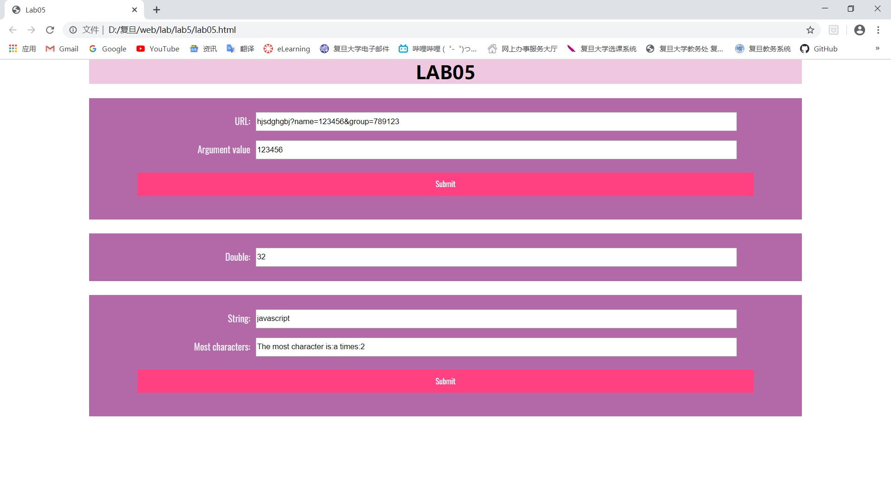
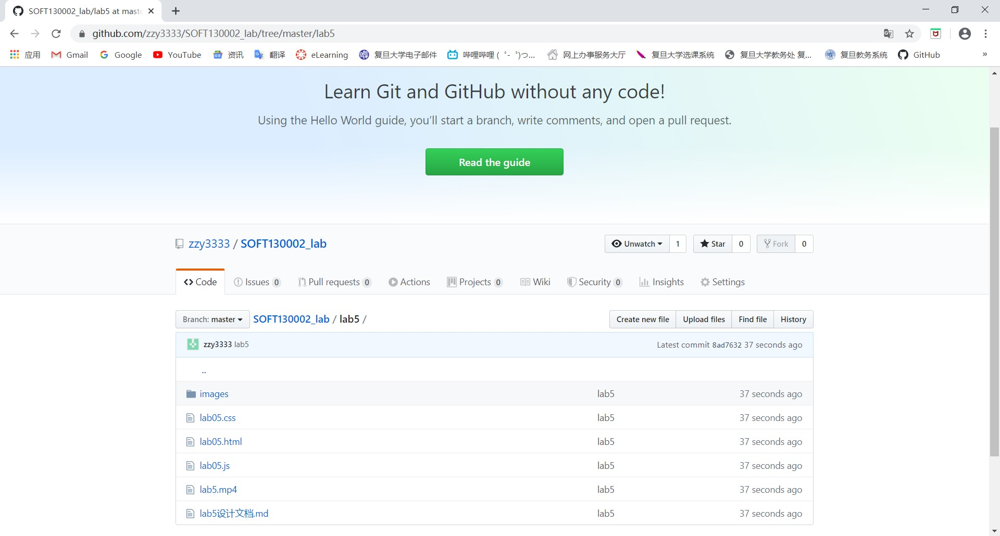

#lab5设计文档
---
###1.
将输入的内容赋值给一字符串，创建一个数组，利用数组遍历的方法，找出字符串中的name，从而将name=后和&前的内容存入数组，再将数组转为字符串即可。
---
###2.
创建一个Date对象和一个计数变量counter，并利用setInterval和clearInterval每隔5秒加倍。但是不知道为什么只能实现10次后停止，不能实现到整分钟时停止。
---
###3.
设置index,num,max变量，利用嵌套的for循环，外层的for循环是遍历每一个字符，里层for循环是对每个字符查找与其相同的字符，从而找出出现次数最多的字符，并将次数存入max中。
---
###网页截图

###gitgub截图
